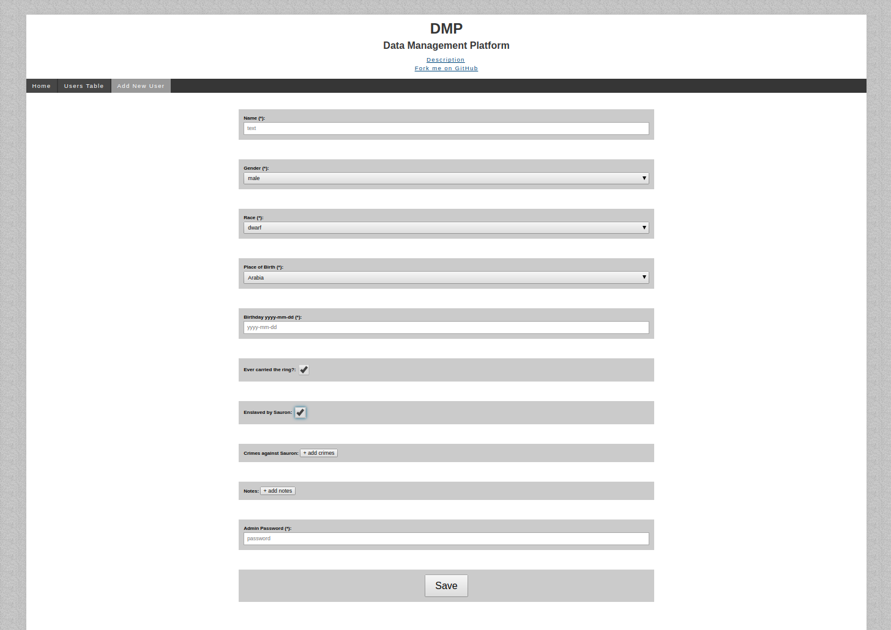
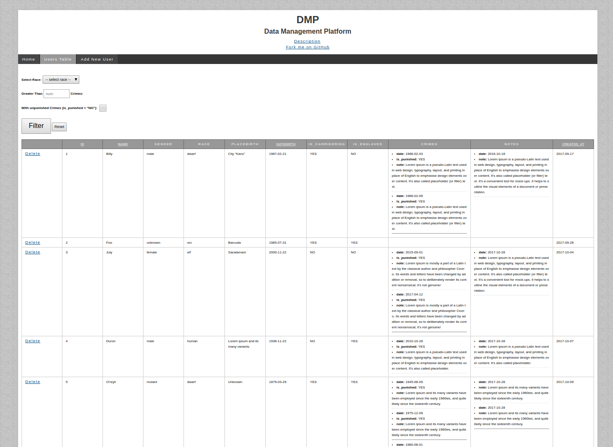

# DMP - Data Management Platform
### Description

Welcome to Simple Data Management Platform.

This App using plain PHP, MVC, OOP, PDO, Namespaces, Composer Autoload, Friendly URL, etc.

There are a simple form (protected by admin password) to add new user in a DB.

There are a page with a table to display all users (also protected by admin password). Available filtering and sorting by some columns in this table and delete users from this table.

### Install
* Download (or Clone) app in your root directory.

* Run `composer install` in your root directory.

* Rename `.htaccess.txt` to `.htaccess` in your root directory. If your web-path not equal `/`, than edit `.htaccess` file for correct work of rewrite rules. Edit line `RewriteBase /`.

* _If you using NGINX server, than use rewrite rules from `.nginx.txt`._

* Load database schema and demo content in your database using `db_dump.sql`

* Rename `app/config/config-sample.php` to `app/config/config.php`. In this file you need to set your database credentials and `BASE_PATH` which will be equal like in line `RewriteBase /` in your `.htaccess` file in your root directory.

### Screenshots

